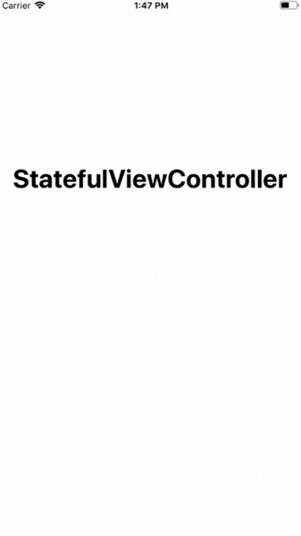

# Reinstate

[](https://travis-ci.org/nevillco/Reinstate)
[](http://cocoapods.org/pods/Reinstate)
[](http://cocoapods.org/pods/Reinstate)
[](http://cocoapods.org/pods/Reinstate)

Reinstate helps you leverage child view controllers in your iOS application to make the code cleaner, easier to maintain, and less bug-prone.

Perhaps one of the most common beginner hurdles in the iOS world is the "massive view controller" - UIKit heavily leans the developer towards an MVC pattern, and in reality that turns into putting everything that is neither a model nor a view inside the controller. There are lots of good ways to alleviate this problem, and one of those ways is to leverage child view controllers.

So let's look at adding a child view controller to a particular view. The Apple-approved way of doing so looks like this:

```swift
// containerView is a subview of self.view,
// controller is the new child view controller
self.addChildViewController(controller)
containerView.addSubview(controller.view)
containerView.translatesAutoresizingMaskIntoConstraints = false
NSLayoutConstraint.activate([
    controller.view.topAnchor.constraint(equalTo: containerView.topAnchor),
    controller.view.leadingAnchor.constraint(equalTo: containerView.leadingAnchor),
    controller.view.trailingAnchor.constraint(equalTo: containerView.trailingAnchor),
    controller.view.bottomAnchor.constraint(equalTo: containerView.bottomAnchor)
])
controller.didMove(toParentViewController: self)
```

This gets substantially more complicated if you want to add animations. However, with Reinstate’s utility functions, this just becomes:

```swift
self.addChild(controller, constrainedTo: containerView)
// or, an animated version:
self.addChild(controller, constrainedTo: containerView, animations: (duration: 0.3, options: .transitionCrossDissolve))
```

You can similarly remove and replace child view controllers this way. But Reinstate goes beyond utilities to add and remove these child view controllers: it provides an interface for integrating them with the state of your parent controller.

`StatefulViewController` is a protocol that can be implemented by UIViewControllers in order to easily represent a state machine. It does so by swapping out child view controllers that you can map to however you model the state of the controller. `StatefulViewController` can greatly cut down on boilerplate, confusing code, and give you an easy, readable API to specify transition animations and settings.

## Example

To run the example project, clone the repo, and run `pod install` from the Example directory first.



```swift
import StatefulViewController

class RootViewController: UIViewController, StatefulViewController {

    enum State {
        case splash
        case onboarding
        case signIn
        case home
    }
    var state = State.splash

    var currentStateManagedChildren: [UIView: UIViewController] = [:]

    override func viewDidLoad() {
        super.viewDidLoad()
        configureInitialState()
    }

}

extension RootViewController {

    func childViewController(for state: RootViewController.State, in view: UIView) -> UIViewController {
        switch state {
        case .splash:
            let vc = SplashViewController()
            vc.delegate = self
            return vc
        case .onboarding:
            let vc = OnboardingViewController()
            vc.delegate = self
            return vc
        case .signIn:
            let vc = SignInViewController()
            vc.delegate = self
            return vc
        case .home:
            let vc = HomeViewController()
            vc.delegate = self
            return vc
        }
    }

    func transitionBehavior(from oldState: RootViewController.State, to newState: RootViewController.State, in view: UIView) -> StateTransitionBehavior {
        switch (oldState, newState) {
        case (.splash, _):
            return StateTransitionBehavior(
                order: .simultaneous,
                additionAnimations: (duration: 0.3, options: .transitionCrossDissolve),
                removalAnimations: (duration: 0.3, options: .transitionCrossDissolve))
        case (.onboarding, .signIn), (.signIn, .home):
            return StateTransitionBehavior(
                order: .addNewChildFirst,
                additionAnimations: (duration: 0.3, options: .transitionFlipFromLeft))
        case (.signIn, .onboarding), (.home, .signIn):
            return StateTransitionBehavior(
                order: .addNewChildFirst,
                    additionAnimations: (duration: 0.3, options: .transitionFlipFromRight))
        default:
            fatalError("Unexpected state transition from \(oldState) to \(newState)")
        }
    }

}

extension RootViewController: SplashViewControllerDelegate {

    func splashViewControllerDidComplete(_ controller: SplashViewController) {
        switch (UserDefaults.standard.isAuthenticated, UserDefaults.standard.hasCompletedOnboarding) {
        case (true, _):
            transition(to: .home)
        case (false, true):
            transition(to: .signIn)
        case (false, false):
            transition(to: .onboarding)
        }
    }

}

// additional delegate conformances omitted for brevity
// see Example/StatefulViewController/RootViewController.swift for full implementation
```

The example demonstrates how you might use `StatefulViewController` to make a `RootViewController`, which configures its state based on whether the user is authenticated, and whether they have seen the onboarding screen.

## Installation

Reinstate is available through [CocoaPods](http://cocoapods.org). To install
it, simply add the following line to your Podfile:

```ruby
pod 'Reinstate'
```

## Author

Connor Neville, connor.neville16@gmail.com

## License

Reinstate is available under the MIT license. See the LICENSE file for more info.
